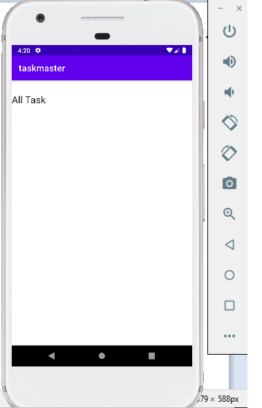
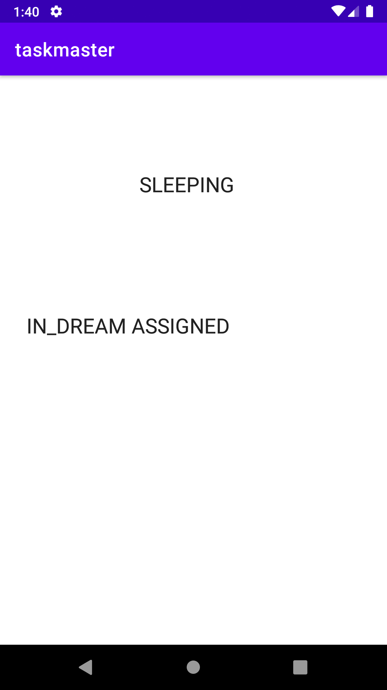

# taskmaster
# LAB 26
# Activities 
### Main Activity

### Add Task

### All Task

# LAB 27
* Added Settings Page
* Added Task Details page
* Updated home page to have 3 hard coded task buttons
* Clicking any of the buttons will bring the user to the detail page carrying the buttons info with it.
* Settings page is set up to save a username
* the saved username will display on the home page

 ### Main Activity

### Task detail

# LAB 28
* Added a list of tasks that has a scrollable feature.
* For the scrollable feature a recycled view is used.
* In the recycled view is a fragment with the tasks
* The three hardcoded buttons were removed

### Main Activity

### Task detail

